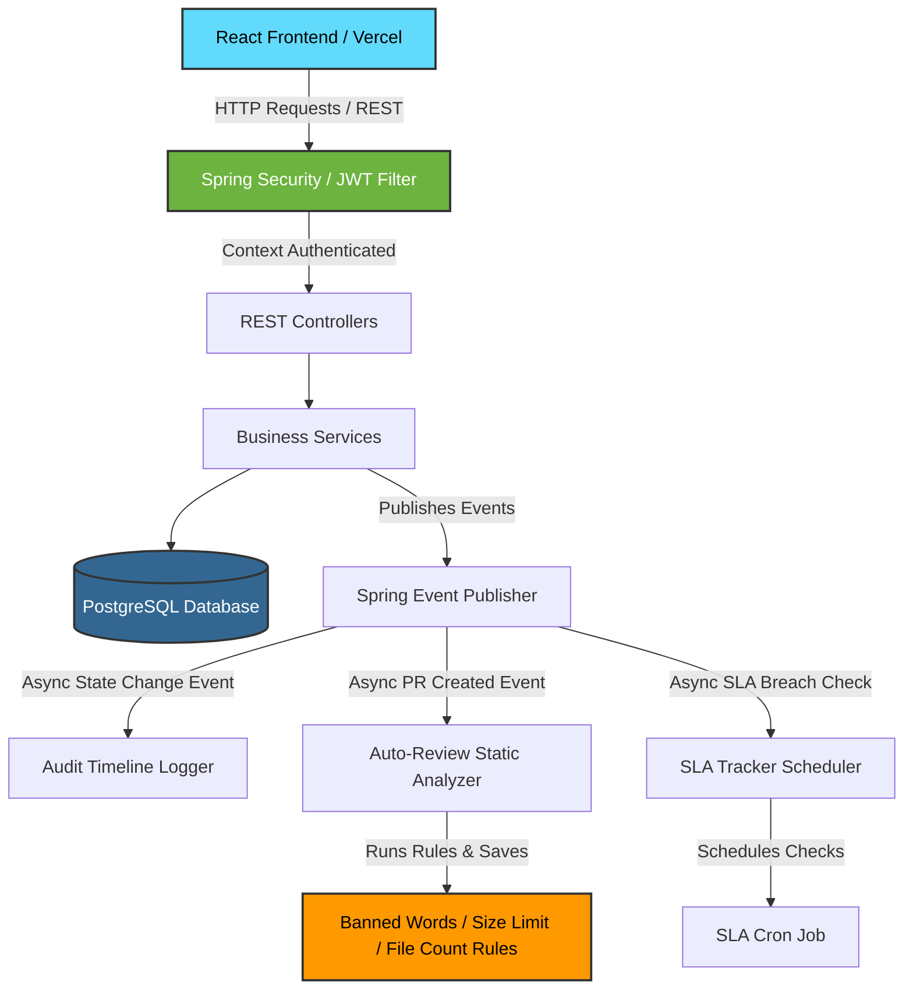

# 💻 CodeCollab — Collaborative Code Review & PR Management System

<p align="center">
  
  
  
  
  
  
  
</p>

CodeCollab is a state-of-the-art, production-ready collaborative code review and pull request orchestration platform. It is engineered with an event-driven architecture using **Spring Boot 3.2.5** and a premium, responsive **React 19** frontend styled with **Tailwind CSS v4**.

---

### 🌐 Live Deployment Links
* 🎨 **Frontend (Vercel):** [https://code-collab-one-omega.vercel.app/](https://code-collab-one-omega.vercel.app/)
* 🔌 **Backend (Render):** [https://codecollab-sc8z.onrender.com](https://codecollab-sc8z.onrender.com)

---

## 🏗️ Component & Event-Driven Architecture

CodeCollab leverages Spring's asynchronous application event multicaster to decouples transaction logic from background tasks like static analysis, database audit logging, and SLA scheduling.



---

## 🔥 Key Technical Capabilities

### ⚡ Asynchronous Auto-Review Engine
When a pull request is submitted, a static analyzer instantly scans code contents and attaches scores/flags using:
* **EmptyDescriptionRule:** Blocks or flags PRs submitted without documentation.
* **BannedKeywordRule:** Scans source code changes for restricted keywords (e.g. `TODO`, `deprecated`, `FIXME`, hardcoded credentials).
* **FileSizeRule:** Flags large file changes exceeding 500 lines to prevent review fatigue.
* **FileCountRule:** Flags PRs containing over 10 changed files, enforcing micro-PRs.

### ⏱️ SLA Breach Management
Ensures rapid code cycles through strict Service Level Agreements:
* Enforces a 24-hour review SLA limit.
* Records submission timestamps and launches asynchronous tracker jobs.
* Triggers event-based warnings (`SLABreachEvent`) and visual badges on dashboards.

### 💬 Inline Line-Level Review Comments
Supports rich collaborative loops:
* Reviewers can add comments on specific lines of any file diff.
* Thread resolution state management (allows marking feedback threads as `Resolved` once fixed).

---

## 🌐 API Endpoint Specification

### 🔑 Authentication
| Endpoint | Method | Payload | Description |
| :--- | :--- | :--- | :--- |
| `/api/auth/register` | `POST` | `RegisterRequest` | Registers account (ADMIN, DEVELOPER, REVIEWER) |
| `/api/auth/login` | `POST` | `LoginRequest` | Logs in and retrieves JWT bearer token |

### 📂 Repositories & Pull Requests
| Endpoint | Method | Headers | Description |
| :--- | :--- | :--- | :--- |
| `/api/repos` | `POST` | `Bearer <Token>` | Creates a new repository |
| `/api/repos` | `GET` | `Bearer <Token>` | Returns all active repositories |
| `/api/prs` | `POST` | `Bearer <Token>` | Opens a PR with code diffs & assigned reviewers |
| `/api/prs/{id}/files` | `GET` | `Bearer <Token>` | Retrieves all modified files under a PR |
| `/api/prs/files/{fileId}/diff` | `GET` | `Bearer <Token>` | Returns line-by-line file diff details |

### 💬 Review & Discussion
| Endpoint | Method | Headers | Description |
| :--- | :--- | :--- | :--- |
| `/api/prs/{prId}/comments` | `POST` | `Bearer <Token>` | Posts an inline line-specific comment |
| `/api/comments/{id}/resolve` | `PATCH` | `Bearer <Token>` | Toggles resolution state of a comment thread |
| `/api/prs/{id}/auto-review` | `GET` | `Bearer <Token>` | Returns static code analyzer warnings |
| `/api/prs/{id}/sla` | `GET` | `Bearer <Token>` | Gets SLA tracker status and hours remaining |

---

## 📁 Repository Directory Structure

```text
codeCollab/
├── backend/
│   ├── src/main/java/com/codecollab/
│   │   ├── admin/             # Admin reporting, dashboard data summaries
│   │   ├── audit/             # Auditable audit logs & lifecycle histories
│   │   ├── auth/              # JWT authorization filter, configs, & login handlers
│   │   ├── autoreview/        # Automated static validation engine & compliance rules
│   │   ├── comment/           # Discussions & thread resolutions
│   │   ├── diff/              # Diff strategy implementations (Line-level comparison)
│   │   ├── events/            # Application events (Audit loggers, Auto-reviewers)
│   │   ├── pullrequest/       # PR state managers, state machines, & state transitions
│   │   ├── repository/        # Project codebase database operations
│   │   ├── sla/               # Deadline counters & cron schedulers
│   │   └── user/              # User domains and roles
│   ├── src/main/resources/    # Application parameters (supports environment variables)
│   └── Dockerfile             # Production multi-stage Docker build pipeline
├── frontend/
│   ├── src/
│   │   ├── api/               # Axios routing config & JWT authorization interceptors
│   │   ├── components/        # Layout, Status badges, Diff viewer, Comment section
│   │   ├── context/           # Authentication state provider
│   │   └── pages/             # Login, Dashboard, Admin panels, New PR, Repository details
│   ├── tailwind.config.js     # Styling setup
│   └── package.json           # Frontend packages
└── run.ps1                    # One-click runner script for local Windows runs
```

---

## 🚀 How to Run Locally

### ⚡ Rapid Launch (Windows PowerShell)
The root directory includes a helper script `run.ps1` that automatically downloads OpenJDK 17 and Apache Maven 3.9.9 locally (without requiring admin configuration or modifying system variables), registers paths, and starts both the React frontend and Spring Boot backend in separate PowerShell windows.

Simply open PowerShell in the project directory and run:
```powershell
powershell -ExecutionPolicy Bypass -File .\run.ps1
```

---

### 🛠️ Manual CLI Launch

#### 1. Database Setup
Ensure you have a running PostgreSQL database and set the connection parameters. Alternatively, the application defaults to connecting to a secure PostgreSQL sandbox database hosted on Render.

#### 2. Start the Backend
```bash
cd backend
# Runs compiler, downloads maven packages, and boots Spring Boot
mvn spring-boot:run
```
*The API server will listen on port `8085`.*

#### 3. Start the Frontend
```bash
cd ../frontend
npm install
# Starts local dev webserver
npm run dev
```
*The client application will run on `http://localhost:5173`.*

---

## 🚢 Cloud Production Deployment

### 🏓 Backend (Render Web Service)
Render does not natively list Java in the runtime menu. Select **Docker** as your runtime to build using the multi-stage Dockerfile.
* **Runtime:** `Docker`
* **Root Directory:** `backend`
* **Environment Variables:**

| Key | Value | Details |
| :--- | :--- | :--- |
| **`DATABASE_URL`** | `jdbc:postgresql://<host>:<port>/<db>` | Database connection endpoint URL |
| **`DATABASE_USERNAME`** | `your_user` | DB login username |
| **`DATABASE_PASSWORD`** | `your_pass` | DB login password |
| **`JWT_SECRET`** | `404E635266556A586E3272357538782F413F4428472B4B6250645367566B5970` | Secure signing key for tokens |
| **`ALLOWED_ORIGINS`** | `https://code-collab-one-omega.vercel.app` | **Target Frontend URL** |

---

### 🎨 Frontend (Vercel)
Vercel automatically detects Vite configurations inside monorepos.
* **Framework Preset:** `Vite`
* **Root Directory:** `frontend`
* **Environment Variables:**

| Key | Value | Details |
| :--- | :--- | :--- |
| **`VITE_API_URL`** | `https://codecollab-sc8z.onrender.com/api` | **Target Backend URL** (Append `/api` at the end) |
